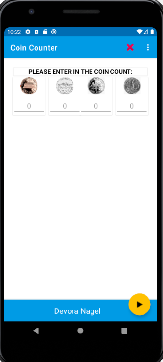
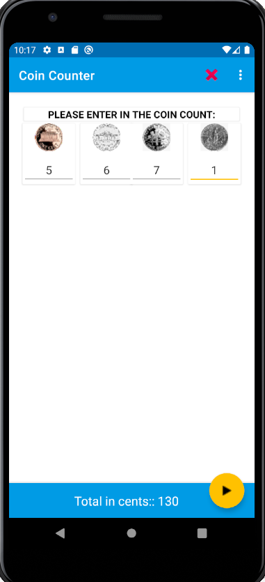

# Coin Calculator

4 cards with each type of coin is displayed.  
User enters the amount for each coin.  
The total will be calculated and displayed on the bottom.   
The "X" button in the top bar clears all the numbers.   

The menu includes an About popup dialog where you can also see the launcher icon:

